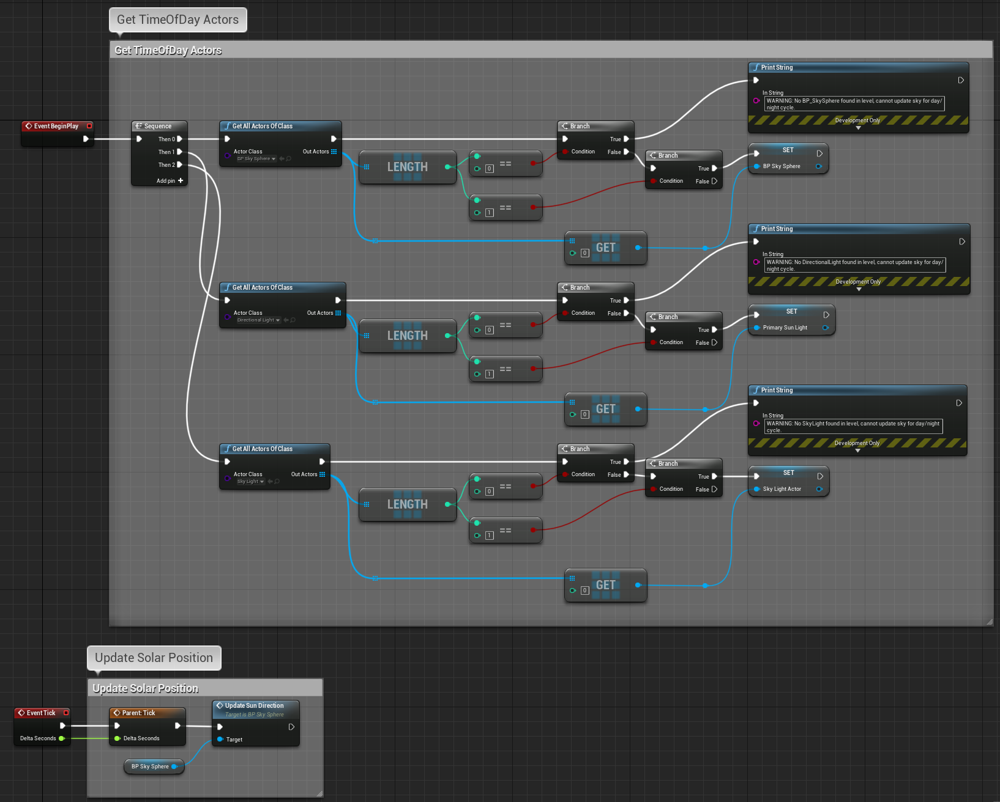

## What is this?

Chronos is an Actor-based Time-of-Day manager for Unreal Engine 4.

99.9% of this code comes from Tom Looman's survival game template at https://github.com/tomlooman/EpicSurvivalGame .

## What does it do?

It tracks a scaled value in-game and rotates the primary SkySphere/DirectionalLight assets in your level to give the appearance of time progression with a day/night cycle. 

## How do I use this?

1. Migrate assets into your project.
2. Pull `BP_Chronos` into your level.
3. Check the BP settings are all intact and/or tweak as desired.
4. Compile/Save/Play.

Blueprint EventGraph for visual reference: 

Note that we need to add a `BP_SkySphere` Object Reference variable in the blueprint in order to fetch the appropriate Actor reference.  